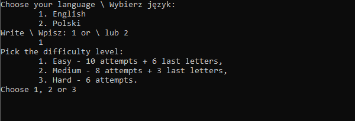
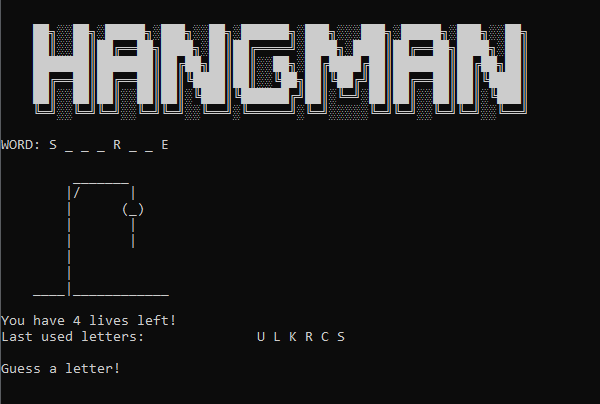
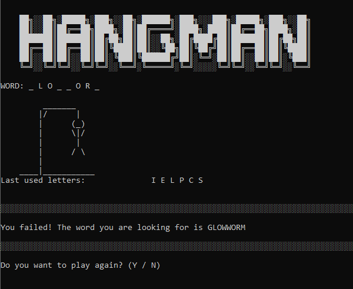

# Hangman
> Its a console version of hangman made in Python.

## Table of contents
* [General info](#general-info)
* [Screenshots](#screenshots)
* [Technologies](#technologies)
* [Setup](#setup)
* [Features](#features)
* [Status](#status)

## General info
It was made to train Python skills. Playable in polish and english with three difficulty level. Words are randomly taken from the .txt files (which you can change). The user have to guess the letters to reveal the hidden word, before the man gets hang.

## Screenshots

## Technologies
* Python 3

## Setup
To run Hangman: 
* clone this repository to your computer
* run comand line
* type "python X:\<cloned repository path>\main.py"

## Features
* English, polish version.
* More than 1100 polish and english words.

## Status
Ready for use.
